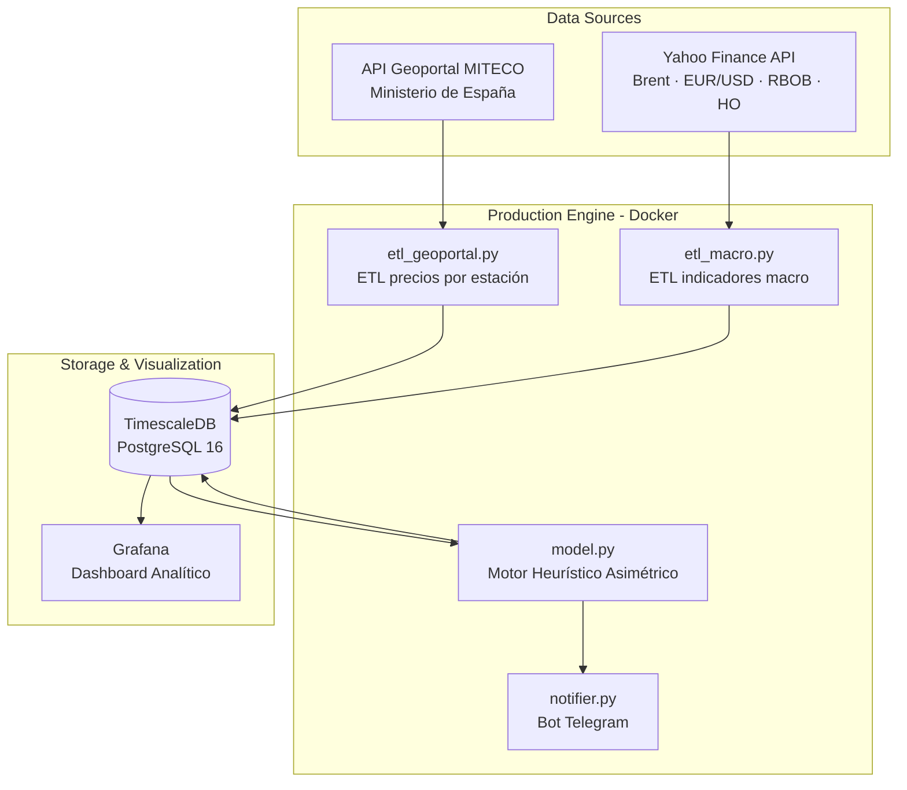
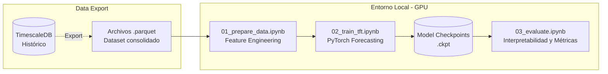
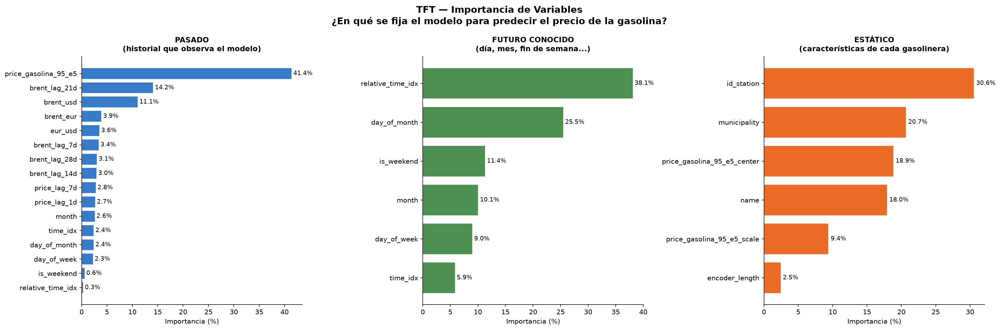
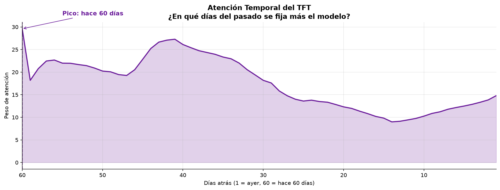
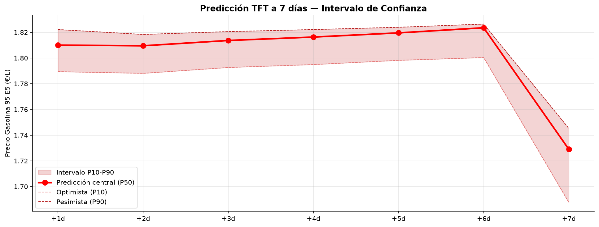
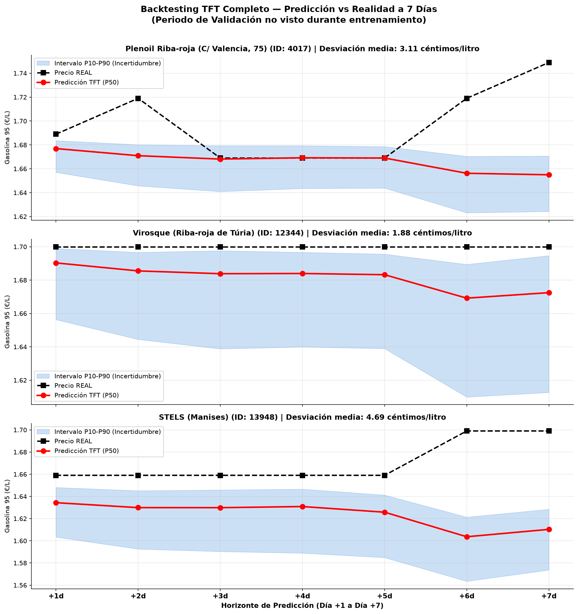

# ⛽ GasPredict — Motor de Optimización de Repostaje


> **GasPredict no predice el precio exacto de la gasolina. Predice cuándo deberías repostar.**
>
> Esta distinción es el resultado central de este proyecto: tras construir y evaluar un modelo de Deep Learning (Temporal Fusion Transformer) con `val_loss=0.0235`, se llegó a la conclusión de que predecir céntimos exactos en un mercado intervenido por oligopolios y regulación estatal es un problema **matemáticamente resoluble pero prácticamente inútil**. Un error de ±2 céntimos no te dice si repostar hoy o mañana. Una heurística bien diseñada, sí.

---

## ¿Qué hace el sistema?

Monitoriza en tiempo real los precios de todos los carburantes de la **Comunidad Valenciana** (fuente: API del Ministerio MITECO), los cruza con los indicadores macroeconómicos (Brent, EUR/USD via Yahoo Finance), y aplica un modelo econométrico basado en el fenómeno de **transmisión asimétrica de precios** ("Efecto Cohetes y Plumas") para recomendar el día óptimo de repostaje en un horizonte de **7 días**.

El resultado llega cada día, a las 07:15 y 18:30, directamente al móvil por Telegram:

```text
⛽ GasPredict — Monitor de Carburantes
📅 Fecha: 02/10/2026 07:15

🛵 Tu Ruta (Getafe → Leganés → Alcorcón) — Moto 10 €:
⭐ Tu Plenoil Getafe:    1.589 €/L  (6.29 L con 10 €)
🏆 Más barata hoy: BALLENOIL LEGANÉS a 1.571 €/L
💰 Ahorro con 10 €: +0.11 €  (+0.07 L extra)

📊 Medias en Comunidad Valenciana:
• Diésel (Gasóleo A):   1.412 €/L
• Gasolina 95 E5:       1.591 €/L

🎯 ¿CUÁNDO REPOSTAR?
⭐ Tu Plenoil Getafe:
   • Mejor día: ¡REPOSTA HOY!
   • Previsión 7 días: +0.023 €/L → Proyectado: 1.612 €/L
   • Consejo: Subida inminente prevista. Reposta hoy para
     congelar el mejor precio.
```

---

## 🏗️ Las Dos Arquitecturas: Producción vs. Investigación

El proyecto mantuvo una clara separación entre el entorno automatizado de producción y el entorno de investigación algorítmica.

### 1. Arquitectura de Producción (Motor Heurístico)
Este es el sistema "en vivo", orquestado con Docker y diseñado para fiabilidad y alertas diarias.



### 2. Pipeline de Investigación ML (Temporal Fusion Transformer)
Entorno offline y manual (GPU local) usado para evaluar si el estado del arte en series temporales podía superar a la heurística determinista.



### Stack tecnológico
| Capa | Tecnología |
|---|---|
| Ingeniería de datos | Python 3.11, Pandas, SQLAlchemy, Schedule |
| Infraestructura | Docker Compose, Raspberry Pi 5 (aarch64) |
| Base de datos | TimescaleDB (PostgreSQL 16 con extensión de series temporales) |
| Visualización | Grafana (dashboards aprovisionados por código) |
| Machine Learning | PyTorch, PyTorch Forecasting, Lightning |

---

## 📁 Estructura del repositorio

```text
GasPredict/
│
├── production_engine/          # 🐳 Motor desplegado en producción
│   ├── docker-compose.yml      #    Orquestación de servicios
│   ├── .env.example            #    Variables de entorno necesarias
│   └── app/
│       ├── main.py             #    Scheduler y orquestador principal
│       ├── etl_geoportal.py    #    Scraping de la API MITECO
│       ├── etl_macro.py        #    Datos de Yahoo Finance
│       ├── model.py            #    Motor de decisión (Cohetes y Plumas)
│       ├── notifier.py         #    Formateador y emisor Telegram
│       └── db.py               #    ORM y acceso a TimescaleDB
│
├── notebooks/                  # 🔬 Investigación ML (no en producción)
│   ├── 01_prepare_data.ipynb   #    Pipeline de datos y feature engineering
│   ├── 02_train_tft.ipynb      #    Entrenamiento del TFT con GPU
│   └── 03_evaluate.ipynb       #    Evaluación e interpretabilidad
│
├── models/                     # 💾 Modelos TFT entrenados
│   ├── tft-full-epoch=00-val_loss=0.0235.ckpt   # Modelo completo (C. Valenciana)
│   └── tft-gaspredict-epoch=02-val_loss=0.0579.ckpt  # Modelo ruta específica
│
├── data/                       # 📊 Datasets
│   ├── gaspredict_prices.csv.gz         # Histórico de precios por estación
│   ├── gaspredict_macro.csv             # Series macro (Brent, EUR/USD...)
│   ├── train_route.parquet              # Dataset de entrenamiento (ruta)
│   ├── train_full.parquet               # Dataset de entrenamiento completo
│   └── station_dna_clusters.parquet     # Clustering de estaciones
│
└── docs/
    └── market_research_gas_stations.md  # Análisis estructural del mercado
```

---

## 🧠 Los Dos Cerebros: Producción vs. Investigación

### 1. Motor de Producción — Heurística Asimétrica

La pieza central del sistema es el **motor de decisión** en [`model.py`](production_engine/app/model.py).

No predice el precio exacto. Predice la **dirección y velocidad** del cambio de precio usando el fenómeno conocido en economía energética como "Efecto Cohetes y Plumas":

| Escenario | Comportamiento real del mercado | Cómo lo modela GasPredict |
|---|---|---|
| **Brent sube** | Las gasolineras suben en **2-3 días** para proteger márgenes de reposición | Ventana de transmisión: **7 días** → alerta inmediata "¡REPOSTA HOY!" |
| **Brent baja** | Las gasolineras aguantan el precio alto **semanas o meses** para vaciar el inventario caro | Ventana de transmisión: **14 días** → "Espera, bajará antes del [día]" |

La asimetría está explícita en el código:
```python
# Subida (cohete): el precio se traslada en ~7 días
w = min(1.0, h / 7.0) if brent_trend > 0 else min(1.0, h / 14.0)
#                                                        ^^^^^^^
#                              Bajada (pluma): tarda el doble en llegar al surtidor
```

**Horizonte de predicción útil: 2-7 días.** Más allá de eso, los factores de ruido (decretos fiscales, rotación de inventarios) anulan cualquier señal.

---

### 2. Investigación ML — El Experimento TFT

Se entrenó un **Temporal Fusion Transformer** (Lim et al., Google Brain 2021) sobre el histórico completo de precios de la Comunidad Valenciana cruzado con macro indicadores.

**Features del modelo:**

| Tipo | Variables |
|---|---|
| Covariables estáticas | `id_station`, `municipio`, `tipo_marca` |
| Futuras conocidas | `día_semana`, `mes`, `es_fin_de_semana` |
| Desconocidas (lags) | `precio_lag_1d`, `precio_lag_7d`, `brent_usd`, `brent_eur`, `eur_usd`, `brent_lag_7/14/21/28d` |

**Resultados:**

| Modelo | Dataset | Val Loss (QuantileLoss) |
|---|---|---|
| `tft-gaspredict` | Ruta específica | 0.0579 |
| `tft-full` | C. Valenciana completa | **0.0235** |

**Gráficos generados:**

Importancia de variables (el modelo aprende que el precio de ayer y el Brent son los principales drivers):



Atención temporal (el modelo aprende a mirar principalmente los últimos 7-14 días):



Predicción a 7 días vs. precio real (el modelo captura la tendencia pero no los saltos):



Backtest en estaciones clave de la ruta:



---

## 🔬 Por qué el TFT no fue a producción

A pesar del buen `val_loss`, el modelo ML fue descartado para producción por razones estructurales del dominio, no por limitaciones técnicas:

**1. La variable más importante no existe en datos públicos**
El principal driver del cambio de precio local es la **rotación del inventario subterráneo** de cada gasolinera. Si una estación compra 40.000 litros un lunes cuando el crudo estaba caro, no bajará el precio hasta agotar ese lote (entre 3 y 14 días según su volumen de ventas). El TFT es completamente ciego a este dato porque es privado.

**2. El modelo compite contra otro algoritmo, no contra la demanda**
Las marcas grandes (Repsol, BP, Cepsa) usan software de fijación dinámica de precios (ej. Kalibrate) con más de 120 reglas de negocio. El modelo estadístico intenta predecir el resultado de un algoritmo privado y determinista, no un comportamiento humano agregado.

**3. El ruido regulatorio es no modelable**
Aproximadamente el 50% del precio final es impuesto fijo (IEH + IVA). Los decretos gubernamentales de emergencia (subvenciones de 20 céntimos, modificaciones del IEH) introducen saltos verticales en la serie temporal que ningún modelo puede anticipar.

**Conclusión:** El TFT es una arquitectura potente que requiere un dominio con señal genuina y endógena. En mercados intervenidos, ciegos al inventario real, el error de ±2 céntimos del modelo no permite tomar ninguna decisión de repostaje mejor que la heurística asimétrica.

---

## 🚀 Cómo ejecutar el Motor de Producción

### Requisitos
- Docker y Docker Compose
- Token de bot de Telegram (opcional, para alertas)

### Configuración

```bash
cd production_engine
cp .env.example .env
# Editar .env con tus credenciales
```

```env
DB_PASSWORD=tu_clave_segura
GRAFANA_PASSWORD=admin_seguro
TELEGRAM_BOT_TOKEN=    # Dejar vacío para desactivar notificaciones
TELEGRAM_CHAT_ID=
```

### Arranque

```bash
docker compose up -d
```

El sistema ejecuta el pipeline automáticamente:
- **07:15** — Actualización matinal (antes de la ruta al trabajo)
- **18:30** — Actualización vespertina (post-cierre de mercados)

Grafana disponible en `http://localhost:3030`

---

## 📚 Investigación de Mercado

El directorio [`docs/`](docs/market_research_gas_stations.md) contiene un análisis exhaustivo de la estructura del mercado minorista de carburantes en España, incluyendo:
- Cadena de suministro y diferenciación química (aditivos HQ300/HQ400)
- Tipología de operadores: COCO, CODO, DODO, Low-Cost
- Estructura fiscal: IEH + IVA (~50% del precio final)
- El efecto "Cohetes y Plumas" con referencias académicas
- Fraude del IVA (Ley 7/2024) y transición energética (RED III)

Este análisis fue clave para tomar la decisión arquitectónica de no usar el TFT en producción.
