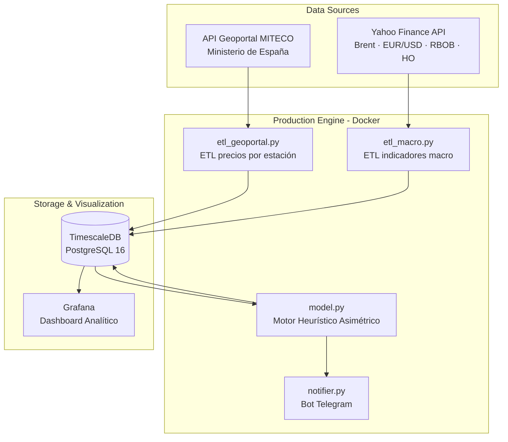
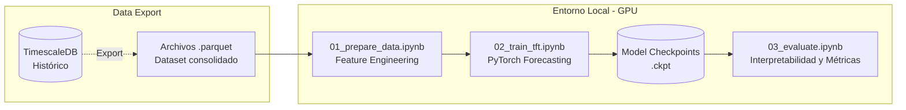

# ⛽ GasPredict — Motor de Optimización de Repostaje

    

**GasPredict es un sistema inteligente de monitorización y recomendación de repostaje de carburantes para la Comunidad Valenciana.** Su objetivo es indicar al usuario el momento óptimo para llenar el depósito maximizando el ahorro, basándose en la transmisión de los precios macroeconómicos al surtidor local.

---

## 🚀 El Sistema Actual (En Producción)

Actualmente, GasPredict funciona como un orquestador automatizado impulsado por un **Motor Heurístico y Econométrico**. No utiliza Inteligencia Artificial para adivinar el precio exacto, sino que aplica reglas matemáticas basadas en el comportamiento real del mercado para recomendar una **acción** (repostar o esperar).

### ¿Qué hace el sistema hoy?

Monitoriza en tiempo real los precios de todos los carburantes (vía API del Ministerio MITECO), los cruza con indicadores macroeconómicos (Brent, EUR/USD) y aplica su motor de decisión. El resultado llega cada día directamente al móvil por Telegram:

```text
⛽ GasPredict — Monitor de Carburantes
📅 Fecha: 02/10/2026 07:15

🛵 Tu Ruta (Getafe → Leganés → Alcorcón) — Moto 10 €:
⭐ Tu Plenoil Getafe:    1.589 €/L  (6.29 L con 10 €)
🏆 Más barata hoy: BALLENOIL LEGANÉS a 1.571 €/L
💰 Ahorro con 10 €: +0.11 €  (+0.07 L extra)

📊 Medias en Comunidad Valenciana:
• Diésel (Gasóleo A):   1.412 €/L
• Gasolina 95 E5:       1.591 €/L

🎯 ¿CUÁNDO REPOSTAR?
⭐ Tu Plenoil Getafe:
   • Mejor día: ¡REPOSTA HOY!
   • Previsión 7 días: +0.023 €/L → Proyectado: 1.612 €/L
   • Consejo: Subida inminente prevista. Reposta hoy para
     congelar el mejor precio.
```

### Cómo funciona el Motor de Decisión

La pieza central del sistema actual (`model.py`) se basa en el **"Efecto Cohetes y Plumas"** (transmisión asimétrica de precios):

| Escenario | Comportamiento del mercado | Cómo lo modela el sistema actual |
|---|---|---|
| **Brent sube** | Las gasolineras suben en **2-3 días** para proteger márgenes | Ventana de transmisión: **7 días** → alerta "¡REPOSTA HOY!" |
| **Brent baja** | Las gasolineras aguantan el precio **semanas** para vaciar inventario | Ventana de transmisión: **14 días** → "Espera a que baje" |

La asimetría está hardcodeada explícitamente en el núcleo de la decisión:
```python
# Subida (cohete): el precio se traslada rápido (penaliza espera)
w = min(1.0, h / 7.0) if brent_trend > 0 else min(1.0, h / 14.0)
#                                                        ^^^^^^^
#                              Bajada (pluma): el descuento tarda el doble en llegar
```

### Arquitectura de Producción

Este es el sistema "en vivo", orquestado con Docker y diseñado para fiabilidad y alertas diarias automáticas.



### 🚀 Cómo ejecutar la versión de producción

1. Copiar el entorno: `cp production_engine/.env.example production_engine/.env`
2. Configurar tokens de Telegram y contraseñas.
3. Levantar servicios: `cd production_engine && docker compose up -d`
4. Grafana disponible en `http://localhost:3030`. Los ETLs se ejecutan automáticamente (07:15 y 18:30).

---

## 🔬 Lo que pretendía ser: El Experimento de Deep Learning (TFT)

Originalmente, el proyecto nació con una ambición puramente orientada al Machine Learning: **predecir el precio exacto del combustible a 7 días vista mediante IA**, con un margen de error mínimo. 

Para ello, se construyó un pipeline de investigación utilizando el estado del arte en predicción de series temporales multivariables: el **Temporal Fusion Transformer** (Lim et al., Google Brain 2021).

### Arquitectura de Investigación ML

El entrenamiento se realizó en un entorno local offline con GPU, alimentado por volcados históricos de la base de datos de producción.



### Resultados del Entrenamiento

El modelo se alimentó con covariables estáticas (`id_station`, marca), variables futuras (`día_semana`, festivos) y lags macroeconómicos. 

Se lograron resultados matemáticamente prometedores:
- **Modelo completo (C. Valenciana):** `val_loss` de **0.0235** (QuantileLoss)
- **Modelo subconjunto (ruta del usuario):** `val_loss` de **0.0579**

**Interpretabilidad del TFT:**
Gracias a las capas de atención del TFT, pudimos extraer la importancia de las variables (el modelo aprendió correctamente que el precio anterior y el lag del Brent eran vitales) y su foco temporal (mirando los últimos 14 días):


El backtest demostró que el modelo capturaba perfectamente las inercias a 7 días:


### 🛑 Por qué no llegó a producción: La realidad del dominio

Si el modelo era matemáticamente preciso (`0.0235`), **¿por qué se descartó para poner en su lugar la heurística actual?**

El análisis profundo del mercado demostró que las predicciones puras de ML en este sector sufren de limitaciones sistémicas:

1. **La variable causal principal es invisible:** El cambio de precio en una gasolinera depende del momento exacto en que llega el camión cisterna a rellenar el tanque subterráneo (la rotación de inventario). Al ser datos corporativos privados, el TFT es estadísticamente "ciego" a la causa real de los saltos de precio.
2. **IA compitiendo contra Algoritmos Privados:** Las grandes marcas usan software privativo (como *Kalibrate*) con cientos de reglas de negocio duras para fijar precios. El TFT no estaba modelando el comportamiento humano, estaba intentando hacer ingeniería inversa a un sistema experto privativo.
3. **Ruido Institucional:** El ~50% del precio en España son impuestos, y el gobierno interviene mediante decretos repentinos que revientan la serie temporal estadística.

**La Gran Lección (El Pivot):** El Machine Learning avanzado brilla donde hay **señales humanas endógenas** y factores predictivos reales (como la demanda de movilidad o asistencia laboral). En un mercado opaco y manipulado artificialmente, predecir el céntimo exacto es un ejercicio de vanidad. Modelar la *acción óptima* mediante heurísticas basadas en "Cohetes y Plumas" resultó ser el producto verdaderamente útil.

---

## 📁 Estructura del Repositorio Completo

```text
GasPredict/
│
├── production_engine/          # 🐳 El sistema actual en producción (Heurística)
│   ├── docker-compose.yml      
│   └── app/                    # Orquestación, ETLs, db.py, model.py y notifier.py
│
├── notebooks/                  # 🔬 Investigación ML (Descartada para prod)
│   ├── 01_prepare_data.ipynb   
│   ├── 02_train_tft.ipynb      
│   └── 03_evaluate.ipynb       
│
├── models/                     # 💾 Modelos TFT entrenados (.ckpt)
├── data/                       # 📊 Datasets históricos y Parquets
│
└── docs/
    └── market_research_gas_stations.md  # Investigación estructural del mercado
```

---

## 📚 Investigación del Mercado

El documento [`docs/market_research_gas_stations.md`](docs/market_research_gas_stations.md) contiene el análisis macro que justificó el pivote del proyecto. Incluye el estudio operativo de las gasolineras (COCO/DODO), la carga impositiva y el origen del "Efecto Cohetes y Plumas".
